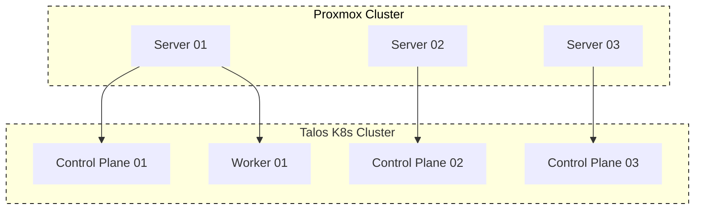
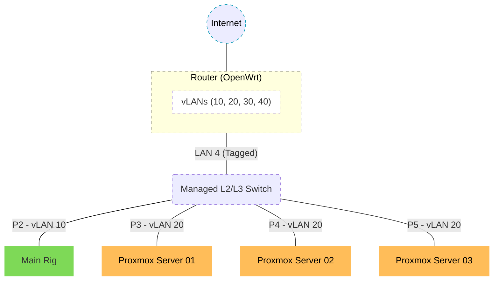

# HomeLab
My personal homelab where I experiment, learn, and break things -- covering networking, virtualization, kubernetes, self-hosted applications and cloud-native tooling!

### 📖 Overview

Below is a high-level snapshot of the technology stack powering my homelab. This setup will continue to evolve as I expand hardware and capabilities - see each section for more details.

| Layer            | Technology / Tooling               | Purpose / Role                                   |
|------------------|------------------------------------|--------------------------------------------------|
| Provisioning     | [OpenTofu](https://opentofu.org/), [Proxmox](https://www.proxmox.com/en/), Talos           | Automate VM and Kubernetes cluster creation      |
| Network          | VLANs, OpenWRT, Managed Switch     | Segmented, secure home network                   |
| Cluster OS       | [Talos](https://docs.siderolabs.com)                              | Immutable, secure Kubernetes OS                  |
| GitOps           | [FluxCD](https://fluxcd.io/)                             | Declarative cluster management from Git          |
| Platform Services| [Cert-Manager](https://cert-manager.io/), [Cilium](https://cilium.io/), [Metrics Server](https://github.com/kubernetes-sigs/metrics-server), [Kubeseal](https://github.com/bitnami-labs/sealed-secrets), [Pangolin](https://docs.pangolin.net/self-host), [Proxmox CSI](https://github.com/sergelogvinov/proxmox-csi-plugin) | Core system services managed via Helm/Kustomize  |
| Apps             | [AdGuard](https://adguard.com/en/adguard-home/overview.html), [Glance](https://github.com/glanceapp/glance), [Karakeep](https://github.com/karakeep-app/karakeep/tree/main), [LittleLink](https://github.com/timothystewart6/littlelink-server), etc. | User workloads, each with configs and overlays   |
| Secrets          | [Bitwarden](https://bitwarden.com/), [SOPS](https://github.com/getsops/sops), [External Secrets](https://github.com/external-secrets/external-secrets)  | Secure secret management and distribution        |

#### Cluster Design
This homelab uses **Proxmox VE** as the virtualization platform, running in clustered mode across 3 physical nodes. On top of Proxmox, **Talos** Linux VMs form a highly available Kubernetes cluster with dedicated control-plane and worker nodes. The setup is intentionally flexible and may evolve over time as new tools, patterns, and industry trends emerge, making the lab a continuously adapting learning environment!

### 🖧 Network Architecture

While this may be considered overkill for a home environment, the design is intentional -- prioritizing hands-on learning and real-world networking practices. The network is built around the following principles:
- VLAN-based isolation
- Least-privilege inter-VLAN access
- Centralized routing and firewalling
- No direct WAN exposure of internal services

#### Topology Diagram

#### vLAN Overview

| vLAN | Purpose           | Description                   |
| ---- | ----------------- | ----------------------------- |
| 10   | User / Management | Workstations and admin access |
| 20   | Homelab           | Proxmox, VMs, Kubernetes      |
| 30   | Media             | Media services and devices    |
| 40   | Guest             | Isolated guest access         |

### ⚙ Hardware Inventory

This section documents my current homelab hardware inventory, which may change as the lab evolves.

#### Network
| Device | Model                                       |   OS      |    Role                | Notes                   |
| ------ | ------------------------------------------- | --------- | ---------------------- | ----------------------- |
| Router | [D-Link M30](https://amzn.in/d/injpNRq)     | OpenWRT   | Edge router & firewall | VLAN routing, DHCP, NAT |
| Switch | [TP-Link SG3210](https://amzn.in/d/caTUAhH) | Omada/OEM | Network segmentation   | VLANs, trunk ports      |

#### Compute
| Node       | Platform              | OS | CPU            | Memory     | Storage    | Role                    |
| ---------- | --------------------- | ----| ---------- | ---------- | ---------- | ----------------------- |
| Main Rig   | Custom Built         | Windows + Ubuntu | Ryzen 7 3700X | 16 GB DDR4  | 512 + 256 GB NVMe, 1TB HDD | All personal stuffs    |
| Server-01 | Custom Built          | Proxmox | Intel i3-3220  | 16 GB DDR3 | 500 GB SSD | Proxmox / Kubernetes |
| Server-02 | ThinkCentre M700 Tiny | Proxmox | Intel i5-6500  | 8 GB DDR4  | 256 GB SSD | Proxmox / Kubernetes    |
| Server-03 | ThinkCentre M700 Tiny | Proxmox | Intel i5-6500T | 8 GB DDR4  | 256 GB SSD | Proxmox / Kubernetes    |

---

#### References

Some good references that I used for exploring and selecting the stuffs mentioned above:
- [Talos + Proxmox](https://blog.stonegarden.dev/articles/2024/08/talos-proxmox-tofu)
- [Homelab networking 101](https://www.virtualizationhowto.com/2025/10/home-lab-networking-101-vlans-subnets-and-segmentation-for-beginners/)
- [TP-Link Omada Switches](https://www.tp-link.com/in/support/faq/4094/)
